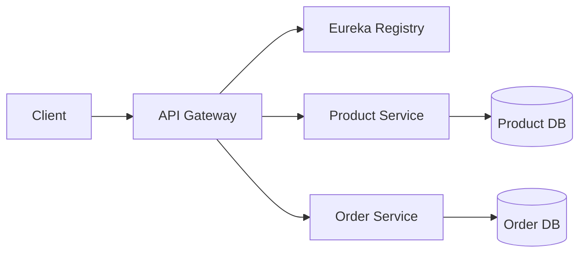

# Sazzler Platform

**Central Hub for Sazzler’s Microservices Ecosystem**

This repository serves as the single entry point to discover, clone, and run the core microservices that power the Sazzler e‑commerce platform.

---

##  Table of Contents

1. [Overview](#overview)
2. [Architecture Diagram](#architecture-diagram)
3. [Services](#services)
4. [Quickstart Guide](#quickstart-guide)
5. [One‑Command Docker Setup](#one-command-docker-setup)
6. [Configuration](#configuration)
7. [Contributing](#contributing)
8. [License](#license)

---

##  Overview

Sazzler is a modular microservices suite built with Spring Boot. Each service runs independently, communicates via a central Eureka registry, and can be developed, tested, and deployed in isolation.

**Core Services:**

* **System Registry (Eureka)** — Handles service discovery and health monitoring.
* **Product Service** — Manages the product catalog and inventory.
* **Order Service** — Processes customer orders and tracks order status.

---

##  Architecture Diagram



*Each service registers with Eureka and exposes REST endpoints.*

---

##  Services

| Service         | Repo URL                                                                                             | Port | Purpose                              |
| --------------- | ---------------------------------------------------------------------------------------------------- | ---- | ------------------------------------ |
| System Registry | [Service reg repo](https://github.com/amodhyh/sazzler-service-registry.git) | 8761 | Service discovery & health dashboard |
| Product Service | [Product Service repo](https://github.com/your-username/product-service) | 8081 | Product catalog & inventory API      |
| Order Service   | [https://github.com/amodhyh/sazzler-service-registry.git](https://github.com/amodhyh/Sazzler-Order-Service.git)     | 8082 | Order placement & tracking API       |

---

##  Quickstart Guide

Follow these steps on your local machine to get all services running:

1. **Clone this hub**

   ```bash
   git clone https://github.com/your-username/sazzler.git
   cd sazzler
   ```
2. **Clone each service**

   ```bash
   git clone https://github.com/your-username/system-registry.git
   git clone https://github.com/your-username/product-service.git
   git clone https://github.com/your-username/order-service.git
   ```
3. **Configure each service**
   In `src/main/resources/application.properties` of **every** service, ensure:

   ```properties
   spring.application.name=<service-name>
   eureka.client.service-url.defaultZone=http://localhost:8761/eureka/
   ```
4. **Start the System Registry**

   ```bash
   cd system-registry
   ./mvnw spring-boot:run
   ```
5. **Start the Product & Order Services**

   ```bash
   cd ../product-service && ./mvnw spring-boot:run
   cd ../order-service   && ./mvnw spring-boot:run
   ```
6. **Verify**

   * Eureka Dashboard → [http://localhost:8761](http://localhost:8761)
   * Product API      → [http://localhost:8081/api/products](http://localhost:8081/api/products)
   * Order API        → [http://localhost:8082/api/orders](http://localhost:8082/api/orders)

---

##  One‑Command Docker Setup

If you prefer Docker, run all services with a single command. Save this as `docker-compose.yml` in the hub root:

```yaml
version: '3.8'
services:
  registry:
    image: your-username/system-registry:latest
    ports:
      - "8761:8761"

  product:
    image: your-username/product-service:latest
    environment:
      EUREKA_CLIENT_SERVICEURL_DEFAULTZONE: http://registry:8761/eureka/
    depends_on:
      - registry
    ports:
      - "8081:8081"

  order:
    image: your-username/order-service:latest
    environment:
      EUREKA_CLIENT_SERVICEURL_DEFAULTZONE: http://registry:8761/eureka/
    depends_on:
      - registry
    ports:
      - "8082:8082"
```

Then execute:

```bash
docker-compose up --build
```

---

## ⚙ Configuration

* **Ports**: Change `server.port` in each service’s `application.properties` if default ports conflict.
* **Profiles**: Use Spring profiles (`dev`, `prod`) to manage environment‑specific settings.
* **Database**: By default, each service uses an in‑memory H2 database. Configure external DBs via `spring.datasource.*` properties.

---

##  Contributing

1. Fork any of the service repos.
2. Create a feature branch: `git checkout -b feature/your-feature`.
3. Commit your changes and open a Pull Request against `main`.
4. Ensure all tests pass and follow code styling conventions.

---

##  License

This project is licensed under the MIT License. See [LICENSE](LICENSE) for details.
