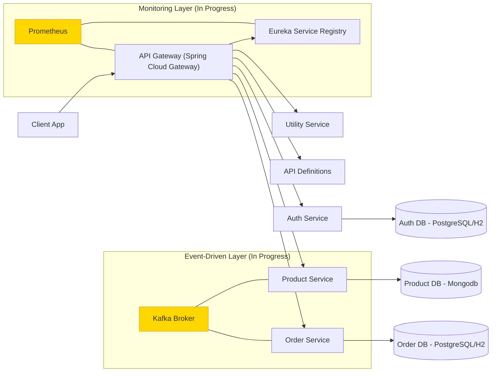

# Sazzler Platform

**Central Hub for Sazzler’s Microservices Ecosystem**

This repository acts as the central hub for the Sazzler e-commerce platform, providing a unified entry point to explore, clone, configure, and deploy its interconnected microservices. Sazzler is engineered as a scalable, fault-tolerant backend system tailored for modern e-commerce needs, emphasizing modularity, security, and performance. By adopting a microservices architecture, it enables independent development, testing, and scaling of components, reducing downtime and facilitating agile iterations.

Launched in July 2025, the project is actively evolving. Core functionalities—such as product management, order processing, and JWT-based authentication—have been implemented, with advanced integrations like Kafka for event-driven communication, Prometheus for real-time monitoring, and Docker/AWS for deployment in the pipeline. This setup leverages Spring Boot's ecosystem to deliver robust RESTful APIs, ensuring seamless inter-service communication while adhering to best practices in backend development.

---

## Table of Contents

1. [Overview](#overview)
2. [Tech Stack](#tech-stack)
3. [Architecture Diagram](#architecture-diagram)
4. [Services](#services)
5. [Security Features](#security-features)
6. [Quickstart Guide](#quickstart-guide)
7. [One-Command Docker Setup](#one-command-docker-setup)
8. [Configuration](#configuration)
9. [Roadmap](#roadmap)
10. [Contributing](#contributing)
11. [License](#license)

---

## Overview

Sazzler represents a comprehensive e-commerce backend built on Spring Boot, designed to handle high-traffic scenarios with ease. Each microservice operates operates autonomously, registering with a Eureka-based service registry for dynamic discovery and load balancing. Communication occurs through RESTful endpoints routed via a centralized API Gateway, promoting loose coupling and resilience.

Key highlights include:
- **Modular Design**: Services can be updated or scaled independently without impacting the overall system.
- **E-Commerce Focus**: Supports essential operations like browsing products, placing orders, and secure user authentication.
- **Extensibility**: Built with future expansions in mind, such as integrating payment gateways or user profiles.
- **Development Status**: As of September 15, 2025, foundational services are operational, with ongoing work on asynchronous features and cloud deployment.

This architecture not only enhances maintainability but also aligns with industry standards for building distributed systems, making Sazzler ideal for learning microservices or prototyping real-world applications.

**Core Services:**
- **Service Registry (Eureka)**: Facilitates service discovery, health checks, and dynamic routing.
- **API Gateway**: Serves as the single entry point for clients, handling request routing, security enforcement, and API aggregation.
- **Auth Service**: Manages user authentication, token issuance, and role-based access control.
- **Product Service**: Oversees product listings, inventory tracking, and search functionalities.
- **Order Service**: Processes orders, manages workflows, and integrates with external systems for fulfillment.
- **Utility Service**: Offers shared utilities for data mapping, validation, and common operations.
- **API Definitions**: Maintains shared schemas and DTOs to ensure API consistency across services.

---

## Tech Stack

Sazzler employs a robust, industry-standard technology stack to ensure reliability, efficiency, and ease of development:

- **Core Framework**: Java 17+ with Spring Boot 3.x for rapid application development and embedded servers.
- **Build & Dependency Management**: Gradle for streamlined builds, multi-module support, and dependency resolution.
- **Microservices Tools**: Spring Cloud (including Eureka for discovery, Gateway for API management).
- **Security**: JWT for token-based auth, with Spring Security for endpoint protection.
- **Data Handling**: DTOs for optimized data transfer; H2 (in-memory) for dev, with PostgreSQL/MySQL planned for prod.
- **Asynchronous Messaging (In Progress)**: Apache Kafka for event-driven architectures, e.g., order status updates.
- **Monitoring & Metrics (In Progress)**: Prometheus for collecting and querying metrics, integrated with Grafana for dashboards.
- **Containerization & Deployment (Planned)**: Docker for packaging, Kubernetes for orchestration, and AWS (EC2, ECS, or EKS) for cloud hosting.
- **Testing & Quality**: JUnit and Mockito for unit/integration tests; SonarQube for code quality analysis.
- **Databases & Persistence**: Spring Data JPA for ORM, with support for relational and NoSQL databases.
- **Other Utilities**: Lombok for reducing boilerplate code, Logback for logging.

This stack prioritizes performance, security, and developer productivity, drawing from proven tools in enterprise environments.

---

## Architecture Diagram



*Description*: Clients interact solely through the API Gateway, which authenticates requests via JWT and routes them to registered services. Databases are isolated per service for data sovereignty. In-progress layers add asynchronous and monitoring capabilities for enhanced scalability.

---

## Services

| Service          | Repo URL                                                                 | Port (Default) | Purpose                                                                 |
|------------------|--------------------------------------------------------------------------|----------------|-------------------------------------------------------------------------|
| API Definitions | [sazzler-api-def](https://github.com/amodhyh/sazzler-api-def.git)       | N/A            | Defines shared API schemas, DTOs, and contracts for uniform interfaces. |
| API Gateway     | [sazzler-api-gateway](https://github.com/amodhyh/sazzler-api-gateway.git) | 8080           | Routes traffic, balances loads, aggregates APIs, and enforces security policies. |
| Auth Service    | [Sazzler-Auth-service](https://github.com/amodhyh/Sazzler-Auth-service.git) | 8083         | Provides user auth, JWT generation/validation, and RBAC (role-based access control). |
| Utility Service | [Sazzler-Utillity](https://github.com/amodhyh/Sazzler-Utillity.git)     | N/A            | Houses reusable components like DTO mappers, validators, and helpers.   |
| Product Service | [sazzler-product-service](https://github.com/amodhyh/sazzler-product-service.git) | 8081       | Manages product CRUD, inventory levels, and search/query endpoints.     |
| Service Registry| [sazzler-service-registry](https://github.com/amodhyh/sazzler-service-registry.git) | 8761     | Eureka server for registering services, monitoring health, and enabling discovery. |
| Order Service   | [Sazzler-Order-Service](https://github.com/amodhyh/Sazzler-Order-Service.git) | 8082       | Handles order creation, status updates, and integration with payment/shipping. |

*Note*: Ports are customizable. Each service is a standalone Spring Boot app built with Gradle, ensuring easy local runs or deployments.

---

## Security Features

Security is embedded at every layer to protect sensitive e-commerce data:
- **Authentication & Authorization**: JWT tokens issued by the Auth Service, validated at the API Gateway. Supports roles like USER, ADMIN for fine-grained access.
- **Data Integrity**: DTOs ensure sanitized, type-safe data exchange, mitigating injection attacks.
- **Gateway Protections**: Rate limiting, CORS configuration, and HTTPS enforcement (planned).
- **Best Practices**: Password hashing with BCrypt, secure headers, and vulnerability scanning via OWASP dependencies.
- **In Progress**: OAuth2 integration for social logins and token refresh mechanisms.
- **Auditing**: Logging of all auth attempts and API calls for compliance and debugging.

These measures align with standards like GDPR and PCI-DSS for handling user and payment data.

---

## Quickstart Guide

Get Sazzler up and running locally in minutes. Prerequisites: Java 17+, Gradle, and Git installed.

1. **Clone this Hub**
   ```bash
   git clone https://github.com/amodhyh/sazzler.git  # Main hub repo
   cd sazzler
   ```

2. **Clone Individual Services**
   ```bash
   git clone https://github.com/amodhyh/sazzler-api-def.git
   git clone https://github.com/amodhyh/sazzler-api-gateway.git
   git clone https://github.com/amodhyh/Sazzler-Auth-service.git
   git clone https://github.com/amodhyh/Sazzler-Utillity.git
   git clone https://github.com/amodhyh/sazzler-product-service.git
   git clone https://github.com/amodhyh/sazzler-service-registry.git
   git clone https://github.com/amodhyh/Sazzler-Order-Service.git
   ```

3. **Configure Services**
   For each service, edit `src/main/resources/application.properties` (or YAML):
   ```properties
   spring.application.name=<service-name>  # e.g., auth-service
   eureka.client.service-url.defaultZone=http://localhost:8761/eureka/
   server.port=<default-port>  # From services table
   # Optional: Database config
   spring.datasource.url=jdbc:h2:mem:testdb
   spring.datasource.username=sa
   spring.datasource.password=
   ```

4. **Start the Registry**
   ```bash
   cd sazzler-service-registry
   ./gradlew bootRun
   ```

5. **Start Remaining Services**
   Open new terminals for each:
   ```bash
   cd ../sazzler-api-gateway && ./gradlew bootRun
   cd ../Sazzler-Auth-service && ./gradlew bootRun
   cd ../sazzler-product-service && ./gradlew bootRun
   cd ../Sazzler-Order-Service && ./gradlew bootRun
   # Utility and API Def are non-runnable (shared libs)
   ```

6. **Verify Setup**
   - Eureka Dashboard: [http://localhost:8761](http://localhost:8761) (check registered instances)
   - Auth Endpoint: POST [http://localhost:8083/auth/login](http://localhost:8083/auth/login) with JSON payload { "username": "test", "password": "test" } to get JWT.
   - Product API: GET [http://localhost:8081/products](http://localhost:8081/products) (include JWT in Authorization header).
   - Order API: POST [http://localhost:8082/orders](http://localhost:8082/orders) (with JWT).

Troubleshooting: Ensure no port conflicts; logs are in console or `logs/` directory.

---

## One-Command Docker Setup

For a containerized environment (currently basic; full orchestration in progress), create `docker-compose.yml` in the hub root. Each service needs a `Dockerfile` (e.g., multi-stage build with Gradle).

```yaml
version: '3.8'
services:
  service-registry:
    build: ./sazzler-service-registry
    ports:
      - "8761:8761"
    healthcheck:
      test: ["CMD", "curl", "-f", "http://localhost:8761"]
      interval: 10s

  api-gateway:
    build: ./sazzler-api-gateway
    environment:
      EUREKA_CLIENT_SERVICEURL_DEFAULTZONE: http://service-registry:8761/eureka/
    depends_on:
      service-registry:
        condition: service_healthy
    ports:
      - "8080:8080"

  auth-service:
    build: ./Sazzler-Auth-service
    environment:
      EUREKA_CLIENT_SERVICEURL_DEFAULTZONE: http://service-registry:8761/eureka/
    depends_on:
      service-registry:
        condition: service_healthy
    ports:
      - "8083:8083"

  product-service:
    build: ./sazzler-product-service
    environment:
      EUREKA_CLIENT_SERVICEURL_DEFAULTZONE: http://service-registry:8761/eureka/
    depends_on:
      service-registry:
        condition: service_healthy
    ports:
      - "8081:8081"

  order-service:
    build: ./Sazzler-Order-Service
    environment:
      EUREKA_CLIENT_SERVICEURL_DEFAULTZONE: http://service-registry:8761/eureka/
    depends_on:
      service-registry:
        condition: service_healthy
    ports:
      - "8082:8082"

  # Kafka (In Progress)
  kafka:
    image: bitnami/kafka:latest
    ports:
      - "9092:9092"
    depends_on:
      - zookeeper  # Add Zookeeper service if needed

volumes:
  kafka-data:
```

Run:
```bash
docker-compose up --build -d
```

*Notes*: Builds images from local code. Health checks ensure startup order. Expand for databases (e.g., PostgreSQL volume) or Kafka. Planned: AWS ECS integration for production.

---

## Configuration

Customize Sazzler to fit your environment:
- **Ports & Networking**: Override `server.port` in properties to resolve conflicts; use `eureka.instance.hostname` for non-localhost setups.
- **Spring Profiles**: Activate via `--spring.profiles.active=prod` for environment configs (e.g., external DBs, logging levels).
- **Database Setup**: Default H2 for simplicity; switch to persistent storage:
  ```properties
  spring.jpa.hibernate.ddl-auto=update
  spring.datasource.url=jdbc:postgresql://db-host:5432/sazzler_db
  spring.datasource.username=user
  spring.datasource.password=pass
  ```
- **JWT & Secrets**: In Auth Service: `jwt.secret=strong-random-key` (use environment variables for security).
- **Logging & Monitoring**: Configure Logback XML for file rotation; integrate Prometheus endpoints via actuator.
- **Environment Variables**: Use `.env` files or Docker env for sensitive data.
- **Scaling**: Eureka supports multiple instances; configure replicas in Docker Compose for high availability.

For advanced tweaks, refer to Spring Boot docs.

---

## Roadmap

- **Implemented (Q3 2025)**: Core microservices, JWT security, DTO-based data flow, basic API Gateway routing.
- **In Progress (Q4 2025)**: Kafka for real-time events (e.g., order notifications), Prometheus/Grafana for metrics visualization, full test suites.
- **Planned (Q1 2026)**: Docker/Kubernetes orchestration, AWS deployment with CI/CD (GitHub Actions), OAuth2 support, persistent databases, payment integration (e.g., Stripe).
- **Long-Term**: Frontend demo (React), machine learning for recommendations, mobile API optimizations.

Track progress via issues in sub-repos. Feedback and contributions are encouraged!

---

## Contributing

Join the development of Sazzler:
1. **Fork a Repo**: Choose the relevant service and fork it.
2. **Branching**: `git checkout -b feature/descriptive-name` or `bugfix/issue-number`.
3. **Develop**: Follow SOLID principles, add tests (aim for 80% coverage), use meaningful commits (e.g., "feat: Add order validation in Order Service").
4. **Test Locally**: Run `./gradlew test` and integrate with the hub.
5. **Pull Request**: Submit to `main` with a clear title, description, and linked issues. Include screenshots for UI/API changes.
6. **Code Style**: Enforce via Checkstyle; use JavaDoc for methods.
7. **Guidelines**: No force pushes; resolve conflicts; sign commits if possible.

We welcome bug reports, feature requests, and docs improvements via issues.

---

## License

This project is licensed under the MIT License - see the [LICENSE](LICENSE) file for details. All contributions are accepted under the same license.
